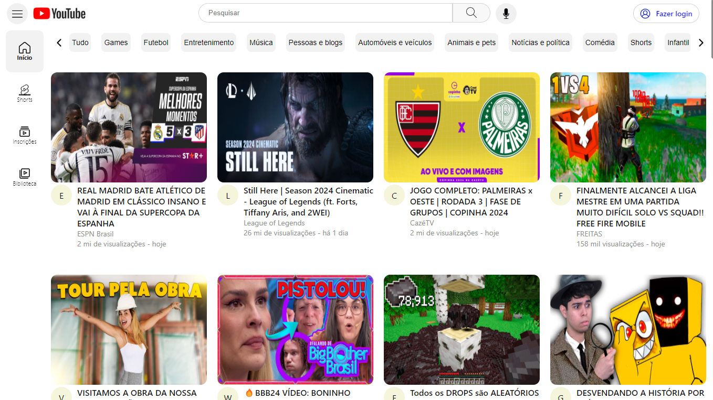

<h1 align="center">Youtube Project</h1>

Este é um projeto aberto. Confira a seguir informações relevantes sobre ele. 

  <a href="#-tecnologias">Tecnologias</a>&nbsp;&nbsp;&nbsp;|&nbsp;&nbsp;&nbsp;
  <a href="#-bibliotecas">Bibliotecas</a>&nbsp;&nbsp;&nbsp;|&nbsp;&nbsp;&nbsp;
  <a href="#-projeto">Projeto</a>&nbsp;&nbsp;&nbsp;|&nbsp;&nbsp;&nbsp;
  <a href="#-instruções">Instruções</a>&nbsp;&nbsp;&nbsp;|&nbsp;&nbsp;&nbsp;
  <a href="#memo-licença">Licença</a>

  

 

  

## 🚀 Tecnologias

Esse projeto foi desenvolvido com as seguintes tecnologias:

- React JS
- Typescript
- Node JS
- Mongo DB

## 📚 Bibliotecas

- Axios
- Styled-components
- Mongoose

## 💻 Projeto

Essa é uma aplicação construída em **React** com **Typescript** baseada no YouTube. Esse projeto possui diversas funcionalidades como pesquisar vídeos, navegar pela barra de categorias onde clicar em algum botão faz com que a página recarregue somente com vídeos relacionados aquela categoria específica. Também é possível criar uma conta e fazer login. Quando logado, é possível cadastrar um novo vídeo com título, thumbnail e descrição. Essa aplicação consome a API de dados do YouTube e também possui uma API própria construída com Node.JS que é responsável pelo cadastro de novos usuários, autenticação e login, cadastro de novos vídeos e colher dados do usuário logado. Essa API integra com um banco de dados que inicialmente era do MariaDB e posteriormente, ao realizar o deploy para o ambiente online, migrado para o Mongo DB. É uma aplicação incrível, completa e extremamente funcional. 

- [Acesse o projeto finalizado, online](https://youtube-project-ten.vercel.app/)

## 📝 Instruções

### Pré-requisitos

Antes de começar, certifique-se de que possui as seguintes ferramentas instaladas em sua máquina:

1. Node.js
1. Git

### Clonando o repositório

Abra o terminal do seu sistema operacional e navegue até o diretório onde deseja clonar o repositório.

Digite o seguinte comando para clonar o repositório:

`git clone https://github.com/RodrigoSerrasqueiro/youtube-project.git`

### Instalando as dependências

Navegue até a pasta do projeto no terminal.

Digite o seguinte comando para instalar as dependências do projeto:

`npm install`

### Executando o projeto

Na pasta do projeto, digite o seguinte comando para iniciar o servidor de desenvolvimento:

`npm start`

Abra o navegador e digite o seguinte endereço:

`http://localhost:3000`

Certifique-se de que a porta 3000 esteja livre em sua máquina.

## Conclusão:

Pronto! Agora você pode clonar e executar o projeto em sua máquina. Caso tenha alguma dúvida ou problema, sinta-se à vontade para abrir uma issue em nosso repositório.

## :memo: Licença

Esse projeto está sob a licença MIT.

---

Desenvolvido por: Rodrigo Serrasqueiro [Dê uma olhada no meu portfólio!](https://github.com/rodrigoSerrasqueiro)